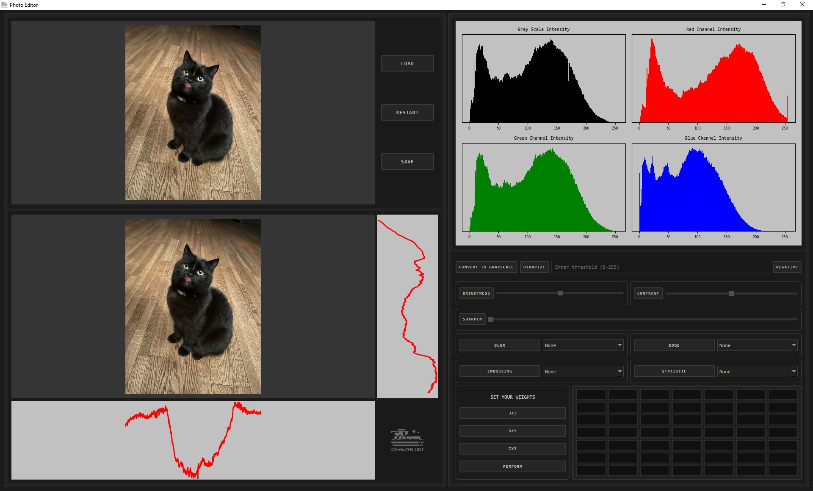

# PhotoEditor
PhotoEditor is an advanced photo editing application written in Python using **PyQt6**, **NumPy**, **Pillow**, and **Matplotlib**.
It provides a powerful GUI-based environment for performing a wide range of image processing operations, including filters, convolutions, projections, and custom matrix operations.



## Features
- Load, display, edit, and save images.
- View original and modified images side by side.
- Visualize horizontal and vertical projections.
- Visualize histograms for image color channels.
- Basic image operations:
  - Convert to grayscale
  - Binarization with custom threshold
  - Negative transformation
- Modify image properties:
  - Adjust brightness
  - Adjust contrast
- Apply filters and effects:
  - Sharpen
  - Blur (multiple types: mean, gaussian, pyramid, etc.)
  - Edge detection (Sobel, Prewitt, Laplacian, Robert's Cross, etc.)
  - Embossing
  - Statistical filters (Median, Minimum, Maximum)
- Manual convolution with custom 3x3, 5x5, or 7x7 matrices.
- Clean and modular GUI layout with responsive design.
## Installation
Clone the repository:
```bash
git clone https://github.com/FilipLangiewicz/PhotoEditor.git
cd photoeditor
```
Install the required dependencies:
```bash
pip install -r requirements.txt
```
> **Note**: You will need a Python version that supports PyQt6 (Python 3.7+).
## Requirements
- Python 3.7+
- PyQt6
- Pillow
- NumPy
- Matplotlib
## Running the Application
```bash
python main.py
```
This will launch the graphical user interface.
## Project Structure
```
PhotoEditor.py             # Main application file
modifiers/                 # Image modification modules (blur, sharpen, contrast, etc.)
plots/                     # Plotting utilities for histograms and projections
utils/                     # Utility functions for image operations
www/                       # Static assets (icons, logos)
```
## Usage Overview
- **Load**: Open an image file.
- **Edit**: Apply various filters and modifications.
- **View**: See histograms and projections live.
- **Save**: Save your edited image.
- **Reset**: Restart to the original loaded image.
